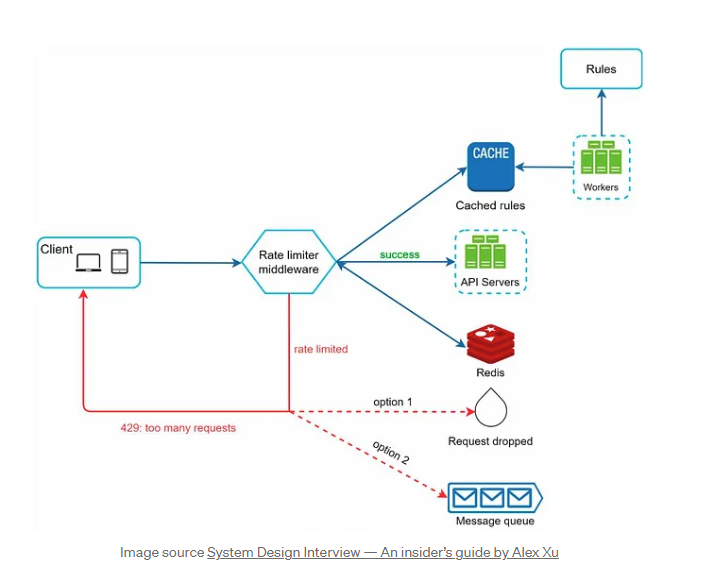
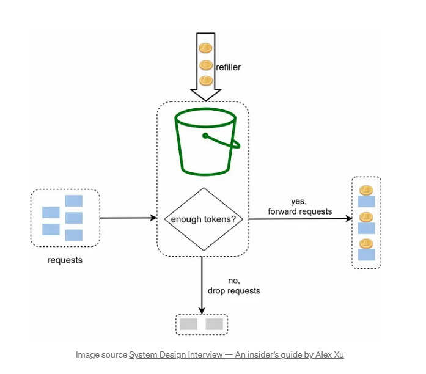
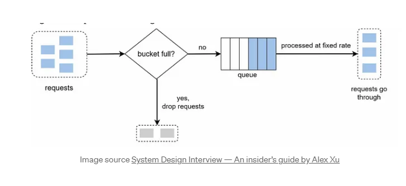
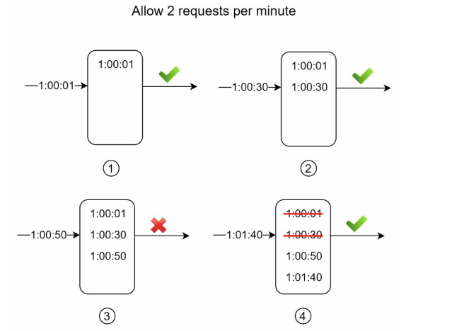

# Rate Limiter

A Rate Limiter limits the number of client requests allowed to be sent over a specified period. If the API request count exceeds the threshold defined by the rate limiter, all the excess calls are blocked.

  

## Algorithms for rate limiting

Rate limiting can be implemented using different algorithms, and each of them has distinct
pros and cons. Even though this chapter does not focus on algorithms, understanding them at
high-level helps to choose the right algorithm or combination of algorithms to fit our use
cases. Here is a list of popular algorithms:

* Token bucket
* Leaking bucket
* Fixed window counter
* Sliding window log
* Sliding window counter

### Token bucket

How It Works:

Tokens are added to a "bucket" at a fixed rate, and each request consumes a token.
If tokens are available, the request is processed; if not, the request is denied.
The bucket can hold a maximum number of tokens, allowing for short bursts of traffic up to a certain point.

  

Pros:
* Allows bursty traffic while still enforcing an average rate over time.
* The bucket can accumulate tokens, allowing users to make several requests in quick succession (as long as they have saved up tokens).
 
Cons:
* More complex to implement than fixed window counters.
* Requires tuning of bucket size and refill rate to balance between allowing bursts and enforcing rate limits.

Use Case:
* Ideal for scenarios where some bursty traffic is expected, but you also want to ensure an average rate over time. Widely used for API rate limiting.

### Leaking bucket

How It Works:

Imagine a bucket with a small hole at the bottom where water (requests) can leak out at a constant rate.
Requests are added to the bucket, and if the bucket overflows (too many requests in a short time), the excess requests are denied.
The bucket leaks at a constant rate, ensuring that requests are processed more evenly over time.

  

Pros:
* Smoothens traffic bursts by spreading out requests over time.
* Ensures that requests are handled at a constant rate, even if they come in bursts.

Cons:
* The constant rate might be too strict in cases where you need some flexibility for occasional bursts of traffic.

Use Case:
* Good for smoothing out bursty traffic. Commonly used in network traffic shaping and rate-limiting in API gateways.

### Fixed window counter

How It Works:

Time is divided into fixed intervals (e.g., 1 second or 1 minute).
A counter is used to keep track of the number of requests a user makes within each window.
If the number of requests exceeds the allowed limit within a window, subsequent requests are denied until the next window starts.

Pros:
* Simple to implement and understand.
* Works well when requests are evenly distributed.
Cons:
* Burstiness: A user could send several requests at the end of one window and several more at the start of the next, effectively bypassing the limit temporarily.
 
Use Case:
* Ideal for scenarios where occasional bursts are acceptable, but you need to restrict usage over longer periods.

### Sliding window log

How It Works:

Similar to the fixed window, but instead of using a fixed window boundary, it maintains a log of timestamps for each request.
When a new request comes in, it checks the request log and removes any entries older than the current window (e.g., older than 1 second).
If the count of remaining requests exceeds the limit, the new request is denied.

  

Pros:
* More accurate than fixed windows because it doesn’t suffer from burstiness.
* Fine-grained control since the log keeps track of each individual request.

Cons:
* Higher memory usage as a log of timestamps for each user must be maintained.
* Slightly more complex to implement due to the need to clean up old requests.

Use Case:
* Ideal for cases where precise control over request bursts is required, such as for API rate limiting.

### Sliding window counter 

How It Works:

Instead of maintaining a detailed log of requests, the sliding window counter approach approximates the request rate.
It splits time into small intervals (e.g., 1 second or 1 minute) and maintains a counter for each interval. When a request comes in, it calculates a weighted average of requests in the current window by looking at the requests in the most recent intervals.

Pros:
* Less memory-intensive than the sliding window log.
* Avoids the burstiness problem of fixed windows while being simpler to implement than a full log of timestamps.

Cons:
* It’s an approximation, so it may be slightly less accurate than sliding window logs.
 
Use Case:
* A good compromise between precision and performance, commonly used for high-traffic APIs.
* This approach is useful in scenarios where you need to enforce a smooth rate limit across a sliding time window and need more granularity than a fixed window counter provides, but you want to avoid the memory overhead of logging individual requests.
