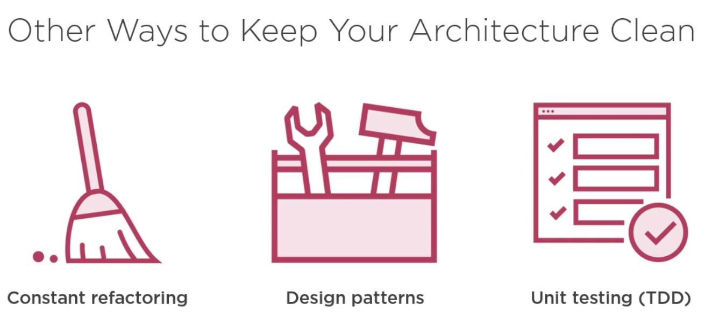

# SOLID Software Design Principles in Java

## Top Benefits of SOLID Code

→ Easy to understand and reason about

→ Changes are faster and have a minimal risk level

→ Highly maintainable over long periods of time

→ Cost effective

SOLID is in a way the foundation of clean code

## Takeaways

> It is not enough to write code that works

> How to control technical debt

> SOLID principles to the rescue

