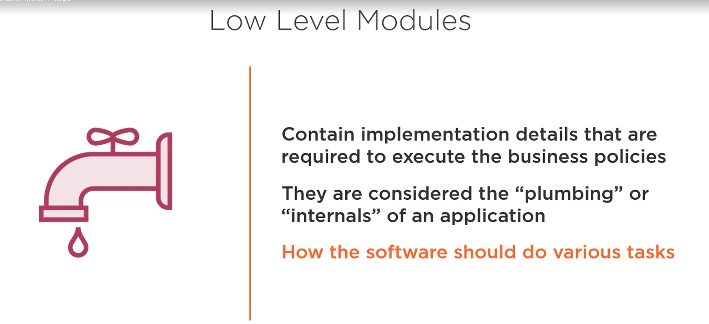

# Decoupling Components with the Dependency Inversion Principle (DIP)

- What is the Dependency Inversion Principle?
- Writing code that respects this principle
- Dependency Injection (DI)
- Inversion of Control (IoC)

Dependency Inversion Principle
1. High-level modules should not depend on low-level modules; both should depend on abstractions.
2. Abstractions should not depend on details. Details should depend upon abstraction.

Exampels of Low Level Modulos

- Logging
- Data access
- Network communication
- IO

### Abstraction

Something that is not concrete.

Something that you can not "new" up. In java applications, we tend to model abstractions using interfaces and abstract classes.

### Dependency Injection

A technique that allows the creation of dependent objects outside of a class and provides those objects to a class.

### Inversion of Control

Inversion of Control is a design principle in which the control of object creation, configuration, and lifecycle is passed to a contained or framework.

IoC Container Benefits

- Makes it easy to switch between different implementations at runtime
- Increase program modularity
- Manages the lifecycle of objects and their configuration

### Spring Bean

Objects used by your application and that are managed by the Spring IoC container. They are created with the configuration that you supply to the container.

DIP, DI and IoC Work very well together

Summary:

- Classes should depened on abstractions, not implementation details
- DIP, DI and IoC work hand in hand to eliminate coupling and make applications less brittle
- Testability can grealty be improved by using the DIP and the DI technique
- Take advantage of the powerful capabilities of the Spring IoC container

> The DIP, DI and IoC are the most effective ways to eliminate code coupling and keep systems easy to maintain and evolve.

