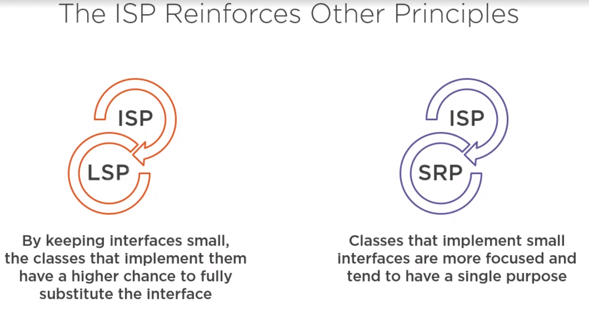
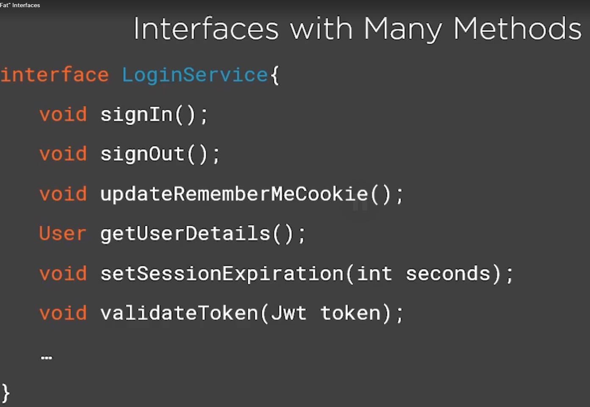
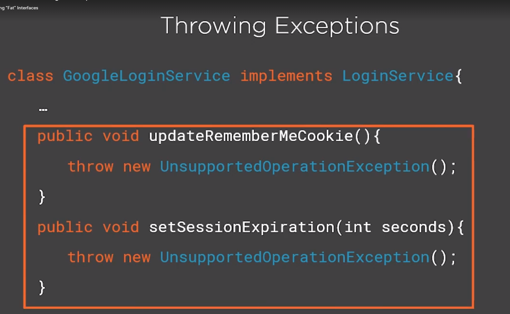
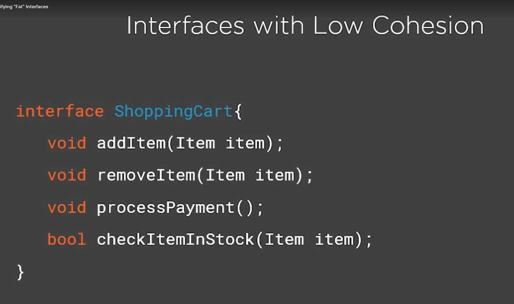
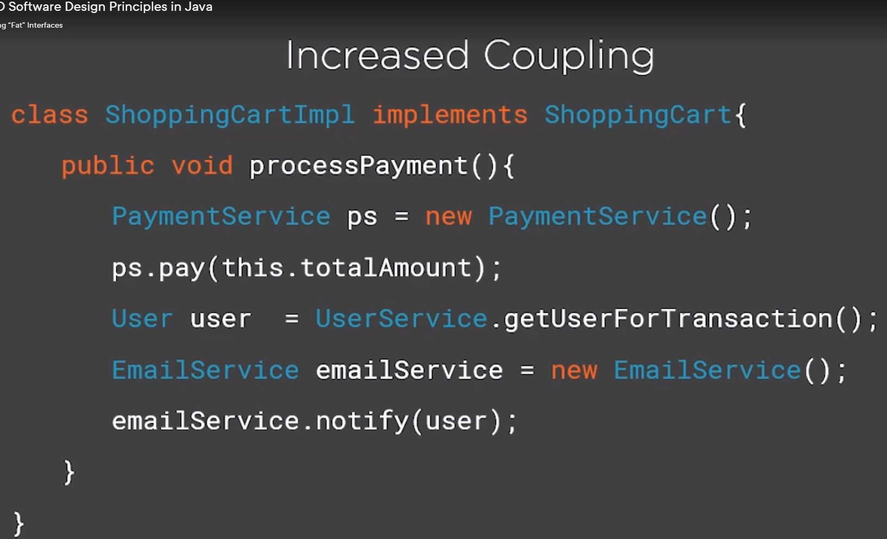
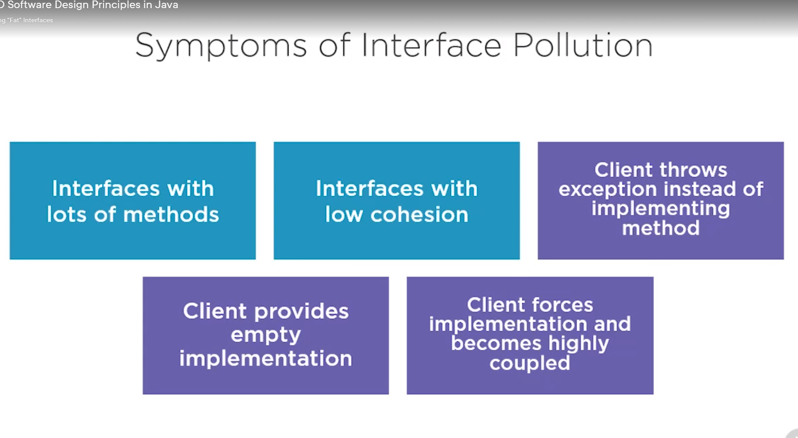

# Modularizing Abstractions with the Interface Segregation Principle (ISP)

- What is the Interface Segregation Principle?
- Identifying "fat" interfaces
- Refactoring code that depends on large interfaces

Interface Segregation Principle: Clients should not be forced to depend on methods that they do not use.

Benefits of Applying the ISP

- Lean interfaces minimize dependencies on unused members and reduce code coupling
- Code  becomes more cohesive and focused
- It reinforces the use of the SRP and LSP

### Identifying "fat" interfaces

Fixing Interface Pollution

- Your own code

Breaking interfaces is pretty easy and safe due to the possibility to implement as many interfaces as we want

- External legacy code

You can't control the interfaces in the external code, so you use design patterns like "Adapter"

**ISP Summary:**

- The ISP is linked with the LSP and SRP
- Don't confuse the word "interface" in the name with a Java interface (because the principle can be broken using abstract classes as well)
- Pay attention to the symptoms of large interfaces and take action
- Break large interfaces into many focused ones for code that you own
    - Use the "Adapter Pattern" for external code
 