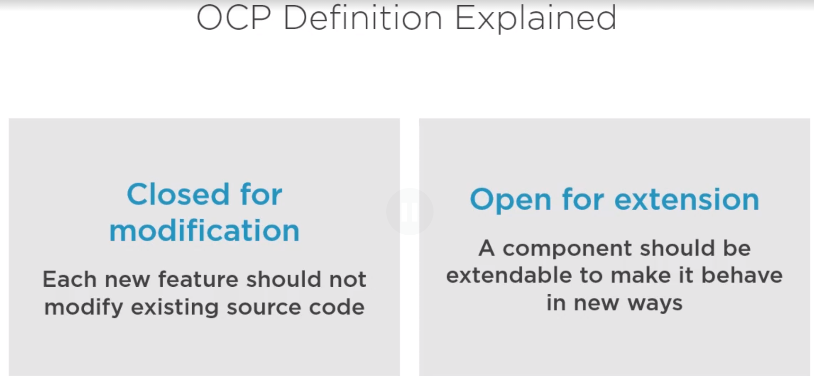
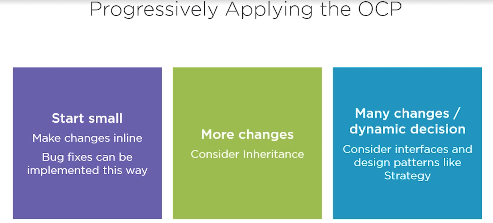

# Evolving Code with Open-Closed Principle (OCP)

Open-Closed Principle: classes, functions, and modules should be closed for modification, but open for extension.

Why should you Apply the OCP?

- New features can be added easily and with minimal cost
- Minimizes the risk of regression bugs
- Enforces decoupling by isolating changes in specific components, works along with the SRP

> SOLID principles are most effective when applied together.

OCP Summary

- Changing requirements are inevitable
- Inheritance and design patterns are effective ways to add features without modifying existing components
- OCP also applies to packages
- Sometimes it is not pragmatic to extend a component and we have to modify it
- Making a flexible design adds more complexity

> OCP is all about changes. Following this principle will lead to elegant designs that are easy and painless to extend. 