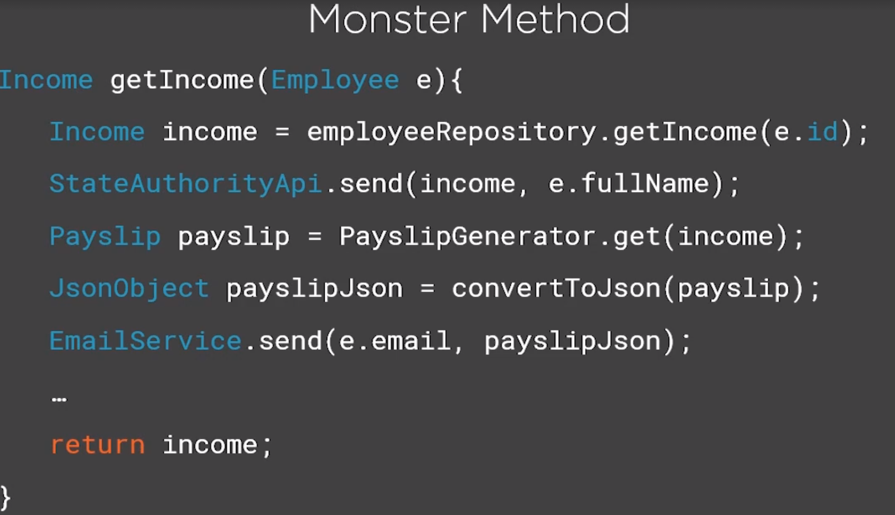
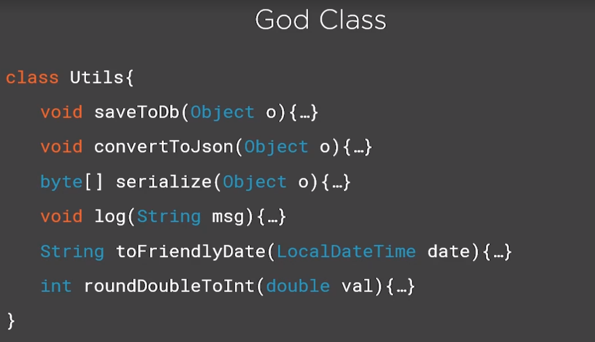

# Understanding the Single Responsibility Principle

- What is the Single Responsibility Principle (SRP) ?
- Identify multiple reason to change
- Danger of having multiple responsibilities
- Demo: refactor to SRP

Single Responsibility Principle defines that:

> Every function, class or module should have one and only one reason to change.

Always identify the reasons to change that your components have and reduce them to a single one.

Why Should you Use SRP?

- It makes code easier to understand, fix, and maintain
- Classes are less coupled and more resilient to change
- More testable design

Identify multiple reason to change

### Danger of Multiple Responsibilities

Symptoms of Not Using SRP

- Code is more difficult to read and reason about
- Decreased quality due to testing difficult
- Side effects
- High coupling

Coupling: The level of inter-dependency between various software components

### Summary

- Correctly identify reasons to change
- The link between high coupling and code fragility
- Refactor responsibilities out to specialized components

> "We want to design components that are self-contained: independent, and with a single, well-defined purpose". — Andrew Hunt & David Thomas, The Pragmatic Programmer

